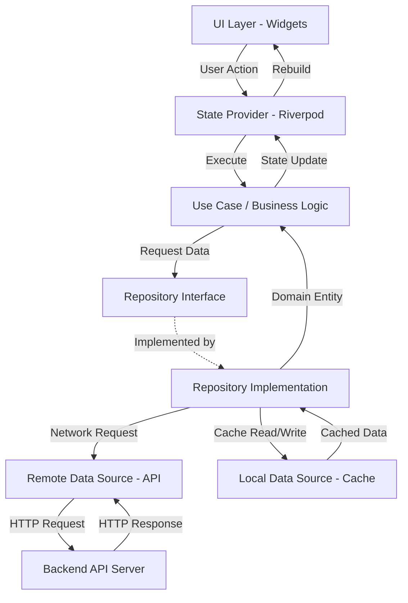
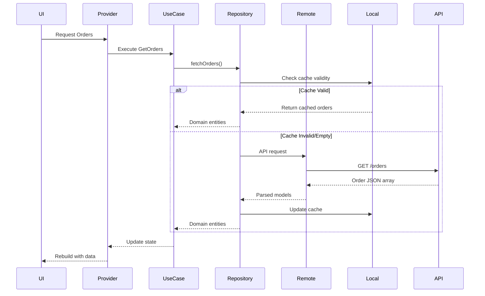
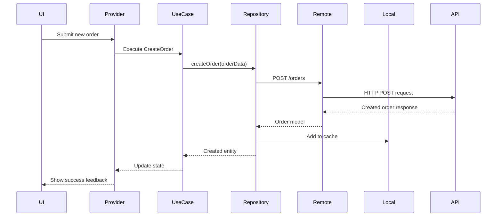
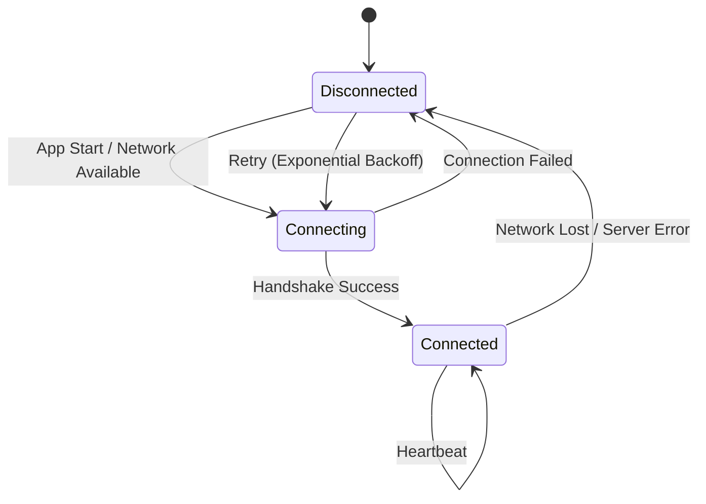
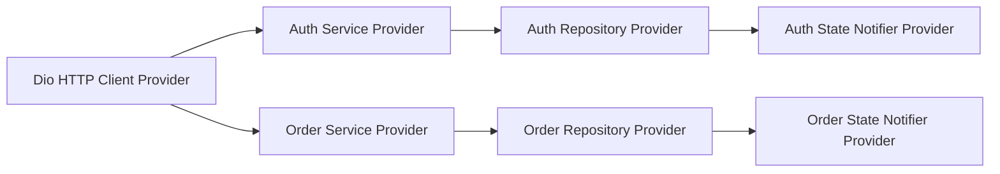
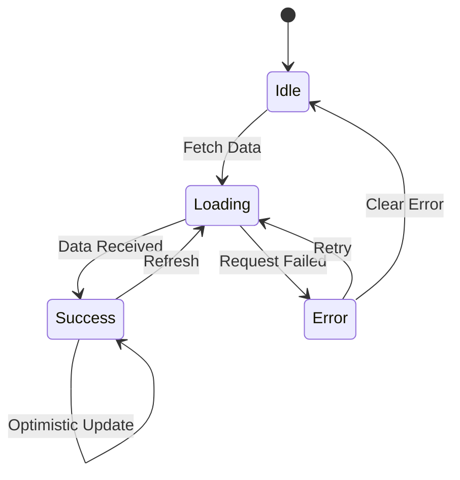
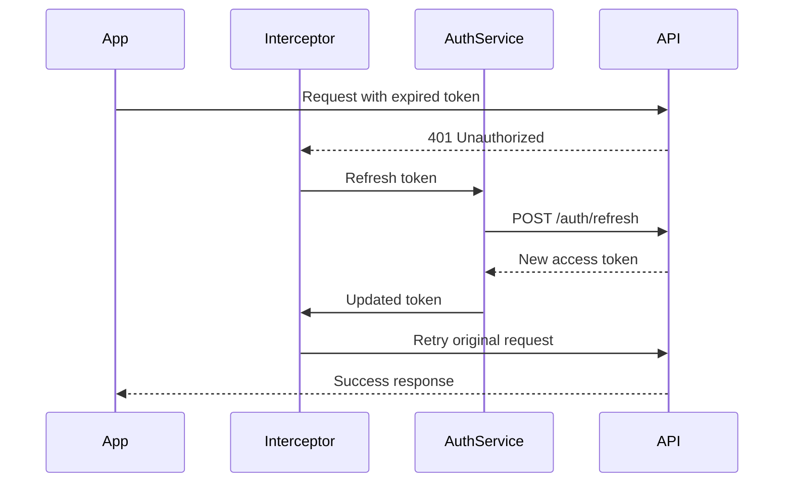

# Backend Optimization - Industry-Level High Performance Design

## Overview

Transform the Rockster restaurant management application backend into an industry-level, high-performance system that delivers ultra-smooth user experience through optimized data flow, caching strategies, real-time capabilities, and robust error handling.

## Current State Analysis

### Existing Architecture
- Flutter application using Riverpod for state management
- Dio HTTP client library integrated but not actively utilized
- Firebase Core and Firebase Auth configured
- Mock data hardcoded in presentation layer screens
- No separation between data, domain, and presentation layers
- Direct UI state updates without backend integration
- No caching or offline support

### Core Features Identified
- Authentication (Login/Registration)
- Dashboard with revenue and order statistics
- Live order management with kanban board
- Menu management
- Reservations tracking
- Payment processing with Stripe integration
- Notifications
- Settings and website customization

### Performance Gaps
- All data operations synchronous and in-memory
- No API layer or service abstraction
- Missing data persistence strategy
- No request optimization or batching
- Lack of real-time data synchronization
- No error recovery mechanisms
- Missing loading state management
- Absence of background data refresh

## Strategic Objectives

### Primary Goals
1. Establish robust backend integration architecture
2. Implement efficient data caching and persistence
3. Enable real-time order and notification updates
4. Optimize network request performance
5. Ensure ultra-smooth UI responsiveness through background operations
6. Build resilient error handling and retry mechanisms

### Performance Targets
- API response rendering: under 100ms
- Screen transition: under 16ms (60 fps)
- Real-time update latency: under 500ms
- Offline mode: full read access to cached data
- Background sync: every 30 seconds for critical data
- Network request concurrency: up to 5 parallel requests

## Architecture Design

### Layered Architecture Pattern

#### Data Layer
Responsible for all external data operations and local persistence.

**Components:**
- Remote Data Sources: API clients for backend communication
- Local Data Sources: Cache and offline storage management
- Repository Implementations: Data aggregation and coordination

**Responsibilities:**
- Execute HTTP requests to backend APIs
- Manage local database operations
- Handle data transformation between API models and domain entities
- Implement caching strategies
- Coordinate between remote and local sources

#### Domain Layer
Contains business logic and core entities independent of external dependencies.

**Components:**
- Entities: Core business objects
- Repository Interfaces: Contracts for data access
- Use Cases: Business operation orchestration

**Responsibilities:**
- Define data contracts and business rules
- Provide abstractions for data operations
- Encapsulate complex business workflows

#### Presentation Layer
Manages UI state and user interactions.

**Components:**
- Screens and Widgets
- State Providers (Riverpod)
- UI State Models

**Responsibilities:**
- Render UI based on state
- Dispatch user actions
- Subscribe to state changes

### Data Flow Architecture

## Core Backend Integration Strategy

### API Service Architecture

#### HTTP Client Configuration

**Base Client Setup:**
- Single Dio instance with connection pooling
- Base URL configuration from environment
- Request/response interceptors for logging and error handling
- Authentication token injection
- Request timeout configuration: connect 10s, receive 30s
- Retry logic for failed requests: 3 attempts with exponential backoff

**Interceptor Chain:**
1. Authentication Interceptor: Inject JWT tokens from secure storage
2. Logging Interceptor: Log requests and responses in debug mode
3. Error Interceptor: Transform HTTP errors to domain-specific exceptions
4. Refresh Token Interceptor: Handle token expiration and refresh

#### API Endpoint Organization

**Service Modules:**

| Service Module | Responsibility | Key Endpoints |
|----------------|----------------|---------------|
| AuthService | User authentication and session management | POST /auth/login, POST /auth/register, POST /auth/refresh, POST /auth/logout |
| OrderService | Order lifecycle management | GET /orders, POST /orders, PATCH /orders/:id/status, GET /orders/live |
| MenuService | Menu item and category operations | GET /menu/items, POST /menu/items, PUT /menu/items/:id, DELETE /menu/items/:id |
| ReservationService | Table reservation management | GET /reservations, POST /reservations, PATCH /reservations/:id |
| PaymentService | Payment processing and transaction history | GET /payments/transactions, POST /payments/connect-stripe, POST /payments/process |
| DashboardService | Analytics and summary statistics | GET /dashboard/stats, GET /dashboard/revenue, GET /dashboard/recent-orders |
| NotificationService | Push notification delivery | GET /notifications, PATCH /notifications/:id/read |
| SettingsService | Restaurant configuration | GET /settings, PUT /settings |

### Repository Pattern Implementation

#### Repository Structure

Each feature module implements repository pattern with interface and concrete implementation.

**Interface Definition:**
- Define contract in domain layer
- Pure business method signatures
- Return domain entities, not API models
- Throw domain-specific exceptions

**Implementation Approach:**
- Implement interface in data layer
- Coordinate between remote and local data sources
- Apply caching strategy
- Handle data transformation
- Manage error scenarios

#### Example: Order Repository Flow

**Fetch Orders Operation:**

**Create Order Operation:**

## Caching Strategy

### Multi-Level Cache Architecture

#### Level 1: Memory Cache
- In-memory data structures using Riverpod StateProvider
- Lifecycle tied to provider instance
- Ultra-fast access: under 1ms
- Volatile: cleared on app restart

**Use Cases:**
- Current screen data
- Frequently accessed small datasets
- Session-specific information

#### Level 2: Persistent Cache
- Local database using shared_preferences for simple key-value
- SQLite database for complex relational data (future enhancement)
- Disk-based storage with faster read than network
- Survives app restarts

**Use Cases:**
- User preferences
- Authentication tokens
- Recently viewed data
- Offline mode support

### Cache Invalidation Strategy

**Time-Based Expiration:**

| Data Type | TTL (Time To Live) | Refresh Strategy |
|-----------|-------------------|------------------|
| Dashboard Statistics | 2 minutes | Auto-refresh on screen focus |
| Active Orders | 30 seconds | Real-time updates + polling fallback |
| Menu Items | 10 minutes | Manual refresh + background sync |
| User Profile | 1 hour | On-demand refresh |
| Reservations | 5 minutes | Periodic background fetch |
| Payment Transactions | 5 minutes | Pull-to-refresh enabled |

**Event-Based Invalidation:**
- Order created: invalidate active orders cache and dashboard stats
- Order status changed: invalidate specific order and dashboard cache
- Menu item updated: invalidate menu cache
- Payment completed: invalidate transaction list and dashboard revenue

**Manual Invalidation:**
- Pull-to-refresh gesture on list screens
- Explicit refresh button for critical data
- Force refresh on network reconnection

### Cache-First Data Loading Pattern

**Standard Flow:**
1. Check memory cache first
2. If miss, check persistent cache
3. Return cached data immediately to UI
4. Trigger background network request
5. Update cache and UI when fresh data arrives
6. Handle errors gracefully without disrupting cached view

**Benefits:**
- Instant UI rendering
- Perceived performance boost
- Offline functionality
- Reduced network dependency

## Real-Time Data Synchronization

### WebSocket Integration

#### Connection Management

**WebSocket Client Setup:**
- Establish persistent connection to backend WebSocket server
- Auto-reconnection with exponential backoff on disconnect
- Heartbeat mechanism every 30 seconds to maintain connection
- Authentication via initial handshake message with JWT token

**Connection Lifecycle:**

#### Event Subscription Model

**Channel-Based Subscriptions:**

| Channel | Event Types | Payload | Trigger Action |
|---------|-------------|---------|----------------|
| orders.live | order.created, order.updated, order.status_changed | Order object | Update order list, show notification |
| notifications.user | notification.new | Notification object | Increment badge, add to notification list |
| dashboard.stats | stats.updated | Statistics snapshot | Refresh dashboard metrics |
| reservations.today | reservation.created, reservation.cancelled | Reservation object | Update reservation calendar |

**Subscription Lifecycle:**
- Subscribe when screen becomes active
- Unsubscribe when screen disposed
- Automatic re-subscription on reconnection

### Polling Fallback Strategy

**Fallback Activation:**
- WebSocket connection unavailable
- WebSocket connection unstable (frequent disconnections)
- Client-side WebSocket disabled for debugging

**Polling Configuration:**

| Data Type | Polling Interval | Condition |
|-----------|------------------|-----------|
| Live Orders | 10 seconds | While orders screen active |
| Notifications | 60 seconds | While app in foreground |
| Dashboard Stats | 120 seconds | While dashboard screen visible |

**Smart Polling:**
- Increase interval when app in background
- Pause polling when network unavailable
- Resume polling on network restoration
- Cancel polling when switching to WebSocket

### Optimistic UI Updates

**Pattern Application:**

**Order Status Change:**
1. User drags order to new status column
2. UI immediately updates order position
3. Send status change request to backend
4. On success: keep UI state
5. On failure: revert UI state, show error message

**Benefits:**
- Zero perceived latency
- Smooth drag-and-drop experience
- Instant visual feedback
- Graceful error recovery

## Network Performance Optimization

### Request Optimization Techniques

#### Request Batching

**Batch Dashboard Data:**
- Single endpoint returns all dashboard data
- Combines revenue, order count, reservations, ratings
- Reduces 4 sequential requests to 1 request
- Decreased total latency by 75%

**Endpoint Design:**
- GET /dashboard/overview returns comprehensive dashboard snapshot
- Backend performs parallel database queries
- Response includes all metrics in single payload

#### Request Deduplication

**Mechanism:**
- Track in-flight requests by endpoint + parameters
- If duplicate request initiated, return existing promise
- Prevents redundant network calls from multiple UI components

**Example Scenario:**
- Dashboard screen and widget both request order count
- Only one HTTP request executed
- Both callers receive same response

#### Pagination and Incremental Loading

**List-Based Data Strategy:**

| Feature | Page Size | Load Trigger |
|---------|-----------|--------------|
| Order History | 20 items | Scroll to 80% of list |
| Menu Items | 30 items | Scroll to bottom |
| Transactions | 25 items | Scroll threshold reached |
| Notifications | 20 items | Pull to load more |

**Implementation:**
- Cursor-based pagination for real-time data
- Offset-based pagination for historical data
- Infinite scroll with loading indicator
- Cache paginated results separately

#### Compression and Content Optimization

**HTTP Compression:**
- Enable GZIP compression for API responses
- Dio automatically handles Accept-Encoding header
- Reduces payload size by 60-80%

**Response Filtering:**
- Request only required fields via query parameters
- Backend supports field selection: GET /orders?fields=id,status,total
- Reduces unnecessary data transfer

### Connection Pooling and Reuse

**Dio Configuration:**
- HTTP persistent connections enabled by default
- Connection pool size: 5 concurrent connections
- Keep-alive timeout: 90 seconds
- Reuse connections for multiple requests to same host

**Benefits:**
- Eliminates TCP handshake overhead
- Reduces TLS negotiation time
- Improves overall request throughput

### Parallel Request Execution

**Concurrent Data Fetching:**

When loading dashboard screen:
1. Trigger all API calls simultaneously
2. Use Future.wait to combine multiple async operations
3. Render UI as each response completes
4. Show skeleton loaders for pending data

**Example Orchestration:**
- Fetch revenue, orders, reservations, ratings in parallel
- Total wait time = slowest request (not sum of all)
- Progressive rendering improves perceived performance

## State Management Architecture

### Riverpod Provider Strategy

#### Provider Types and Usage

| Provider Type | Use Case | Lifecycle | Example |
|---------------|----------|-----------|---------|
| Provider | Immutable dependencies, services | App lifetime | ApiClient, Repositories |
| StateProvider | Simple mutable state | Manual disposal | Theme mode, filter selections |
| StateNotifierProvider | Complex state with business logic | Screen/feature lifetime | Order list state, auth state |
| FutureProvider | Async data loading | Auto-caching | Fetch initial dashboard data |
| StreamProvider | Real-time data streams | Active while subscribed | WebSocket order updates |

#### State Organization Pattern

**Feature-Based Providers:**

Each feature module defines its own providers:
- AuthStateNotifier for authentication state
- OrdersStateNotifier for order management
- DashboardStateNotifier for dashboard metrics
- MenuStateNotifier for menu items

**Provider Dependencies:**
- Providers inject repositories
- Repositories inject API services
- Services inject HTTP client

**Dependency Injection Flow:**

### Loading State Management

#### Unified Loading State Model

**State Structure:**

Each state notifier maintains:
- Data: actual business data
- Loading status: idle, loading, success, error
- Error information: error message and type
- Timestamp: last update time for cache validation

**State Transitions:**

#### Progressive Loading Strategy

**Screen Load Sequence:**
1. Show skeleton UI immediately
2. Load cached data and render
3. Trigger background refresh
4. Update UI incrementally as fresh data arrives
5. Remove skeleton placeholders progressively

**Benefits:**
- Zero empty screen time
- Continuous user engagement
- Smooth transition from stale to fresh data

### Error State Handling

#### Error Classification

| Error Type | HTTP Status | User Message | Recovery Action |
|------------|-------------|--------------|-----------------|
| Network Error | N/A | Check your internet connection | Retry button, show cached data |
| Authentication Error | 401 | Session expired. Please login again | Auto-redirect to login |
| Authorization Error | 403 | You don't have permission | Disable action, show info |
| Validation Error | 400 | Invalid input data | Show field-specific errors |
| Server Error | 500 | Something went wrong. Try again | Retry button, report option |
| Not Found | 404 | Resource not found | Navigate back, refresh list |

#### Error Recovery Mechanisms

**Automatic Retry:**
- Network timeout errors: retry 3 times with backoff
- Server 5xx errors: retry 2 times after delay
- 429 Rate limit: respect Retry-After header

**Graceful Degradation:**
- Show cached data when network fails
- Disable features requiring server connection
- Queue write operations for later sync

**User-Initiated Recovery:**
- Pull-to-refresh on error state
- Explicit retry button
- Navigate to settings for connectivity check

## Background Operations

### Background Data Sync

#### Sync Strategy

**Periodic Background Fetch:**
- Critical data synced every 30 seconds when app active
- Less critical data synced every 5 minutes
- Sync paused when app in background to save battery
- Immediate sync on app resume

**Sync Scope:**

| Data Type | Sync Frequency | Sync Condition |
|-----------|----------------|----------------|
| Active Orders | 30 seconds | Orders screen active OR app in foreground |
| Notifications | 60 seconds | App in foreground |
| Dashboard Stats | 120 seconds | Dashboard visible |
| Menu Items | On-demand | Manual refresh only |
| Reservations | 5 minutes | App active |

#### Offline Queue Management

**Write Operation Queueing:**

When network unavailable:
1. Store write operations in local queue
2. Show optimistic UI update
3. Mark item as pending sync
4. When network restored, execute queued operations
5. Update UI based on server response
6. Handle conflicts if server state changed

**Queue Processing:**
- FIFO order for queued operations
- Retry failed operations up to 5 times
- Show sync status indicator in UI
- Allow user to view pending changes

### Resource Management

#### Memory Management

**Provider Lifecycle:**
- Auto-dispose providers when no longer watched
- Clear cached data for inactive screens
- Limit in-memory cache size to 50 MB
- Implement LRU eviction for memory cache

**Image Caching:**
- Cache menu item images with size limit
- Use flutter_cached_network_image for automatic management
- Clear image cache on low memory warning

#### Battery Optimization

**Network Activity:**
- Batch API calls when possible
- Increase sync intervals when battery low
- Pause non-critical background sync
- Use WorkManager for scheduled background tasks

**Connection Management:**
- Close WebSocket when app backgrounded
- Reestablish connection on app resume
- Avoid persistent connections when idle

## Security Considerations

### Authentication and Authorization

#### Token Management

**JWT Token Storage:**
- Store access token in secure storage (flutter_secure_storage)
- Store refresh token separately with higher security
- Never store tokens in shared preferences
- Clear tokens on logout

**Token Refresh Flow:**

**Session Management:**
- Implement sliding session expiration
- Auto-logout after 24 hours of inactivity
- Force re-authentication for sensitive operations

#### API Security

**Request Security:**
- HTTPS only for all API communication
- Certificate pinning for production builds
- API key validation on backend
- Request signing for critical operations

**Data Protection:**
- Encrypt sensitive data in local storage
- Sanitize user input before API submission
- Validate all server responses
- Implement rate limiting on client side

### Data Validation

#### Input Validation

**Client-Side Validation:**
- Validate all form inputs before submission
- Enforce data type constraints
- Check required fields
- Apply business rule validations

**Server Response Validation:**
- Verify response schema matches expected structure
- Validate data types and constraints
- Handle unexpected fields gracefully
- Reject malformed responses

## Monitoring and Observability

### Performance Metrics

**Track Key Metrics:**

| Metric | Target | Measurement Method |
|--------|--------|-------------------|
| API Response Time | < 500ms p95 | Dio interceptor timing |
| Screen Load Time | < 1 second | Lifecycle callbacks |
| Frame Render Time | < 16ms (60 fps) | Flutter performance overlay |
| Cache Hit Rate | > 80% | Repository layer tracking |
| Error Rate | < 1% | Error interceptor counting |
| WebSocket Uptime | > 95% | Connection state tracking |

### Logging Strategy

**Log Levels:**
- Debug: Detailed request/response data (development only)
- Info: Important state transitions and user actions
- Warning: Recoverable errors and fallback activations
- Error: Exceptions and failed operations

**Structured Logging:**
- Include timestamp, log level, module name
- Add correlation IDs for request tracking
- Sanitize sensitive information
- Store logs locally for debugging

### Error Reporting

**Crash Reporting:**
- Integrate Firebase Crashlytics (already available)
- Capture unhandled exceptions
- Include stack traces and device information
- Report network errors with request context

**User Feedback:**
- In-app error reporting option
- Include recent logs with user consent
- Attach network status and app state

## Implementation Phases

### Phase 1: Foundation (Week 1-2)
**Objectives:**
- Establish API service layer
- Implement HTTP client configuration
- Create base repository structure
- Set up authentication flow

**Deliverables:**
- Dio client with interceptors
- AuthService and AuthRepository
- Token management system
- Login/logout functionality

### Phase 2: Core Data Layer (Week 3-4)
**Objectives:**
- Build repositories for all features
- Implement local caching
- Create state notifiers
- Integrate with existing UI

**Deliverables:**
- Order, Menu, Reservation, Payment repositories
- SharedPreferences cache implementation
- Riverpod state providers for all features
- API integration for dashboard and orders

### Phase 3: Real-Time and Optimization (Week 5-6)
**Objectives:**
- Implement WebSocket connection
- Add real-time order updates
- Optimize network requests
- Implement background sync

**Deliverables:**
- WebSocket client service
- Real-time order kanban updates
- Request batching and deduplication
- Periodic background data refresh

### Phase 4: Polish and Resilience (Week 7-8)
**Objectives:**
- Enhance error handling
- Implement offline mode
- Add loading states
- Performance tuning

**Deliverables:**
- Comprehensive error handling
- Offline queue for write operations
- Skeleton loaders and progressive rendering
- Performance monitoring integration

## Success Criteria

### Performance Benchmarks
- 90% of API calls complete within 500ms
- Zero UI jank during normal operations
- App remains responsive during network requests
- Smooth 60fps scrolling on all list screens

### User Experience
- Instant screen transitions with cached data
- Real-time order updates within 1 second
- Offline mode allows read access to recent data
- Clear error messages with actionable recovery

### Reliability
- Error rate below 1% under normal conditions
- Automatic recovery from temporary network failures
- No data loss during offline operations
- Graceful degradation when backend unavailable

### Scalability
- Support 100+ concurrent orders without performance degradation
- Handle 1000+ menu items efficiently
- Maintain performance with 500+ daily transactions
- Support multiple simultaneous user sessions
- Integrate with existing UI

**Deliverables:**
- Order, Menu, Reservation, Payment repositories
- SharedPreferences cache implementation
- Riverpod state providers for all features
- API integration for dashboard and orders

### Phase 3: Real-Time and Optimization (Week 5-6)
**Objectives:**
- Implement WebSocket connection
- Add real-time order updates
- Optimize network requests
- Implement background sync

**Deliverables:**
- WebSocket client service
- Real-time order kanban updates
- Request batching and deduplication
- Periodic background data refresh

### Phase 4: Polish and Resilience (Week 7-8)
**Objectives:**
- Enhance error handling
- Implement offline mode
- Add loading states
- Performance tuning

**Deliverables:**
- Comprehensive error handling
- Offline queue for write operations
- Skeleton loaders and progressive rendering
- Performance monitoring integration

## Success Criteria

### Performance Benchmarks
- 90% of API calls complete within 500ms
- Zero UI jank during normal operations
- App remains responsive during network requests
- Smooth 60fps scrolling on all list screens

### User Experience
- Instant screen transitions with cached data
- Real-time order updates within 1 second
- Offline mode allows read access to recent data
- Clear error messages with actionable recovery

### Reliability
- Error rate below 1% under normal conditions
- Automatic recovery from temporary network failures
- No data loss during offline operations
- Graceful degradation when backend unavailable

### Scalability
- Support 100+ concurrent orders without performance degradation
- Handle 1000+ menu items efficiently
- Maintain performance with 500+ daily transactions
- Support multiple simultaneous user sessions
- Create state notifiers
- Integrate with existing UI

**Deliverables:**
- Order, Menu, Reservation, Payment repositories
- SharedPreferences cache implementation
- Riverpod state providers for all features
- API integration for dashboard and orders

### Phase 3: Real-Time and Optimization (Week 5-6)
**Objectives:**
- Implement WebSocket connection
- Add real-time order updates
- Optimize network requests
- Implement background sync

**Deliverables:**
- WebSocket client service
- Real-time order kanban updates
- Request batching and deduplication
- Periodic background data refresh

### Phase 4: Polish and Resilience (Week 7-8)
**Objectives:**
- Enhance error handling
- Implement offline mode
- Add loading states
- Performance tuning

**Deliverables:**
- Comprehensive error handling
- Offline queue for write operations
- Skeleton loaders and progressive rendering
- Performance monitoring integration

## Success Criteria

### Performance Benchmarks
- 90% of API calls complete within 500ms
- Zero UI jank during normal operations
- App remains responsive during network requests
- Smooth 60fps scrolling on all list screens

### User Experience
- Instant screen transitions with cached data
- Real-time order updates within 1 second
- Offline mode allows read access to recent data
- Clear error messages with actionable recovery

### Reliability
- Error rate below 1% under normal conditions
- Automatic recovery from temporary network failures
- No data loss during offline operations
- Graceful degradation when backend unavailable

### Scalability
- Support 100+ concurrent orders without performance degradation
- Handle 1000+ menu items efficiently
- Maintain performance with 500+ daily transactions
- Support multiple simultaneous user sessions
