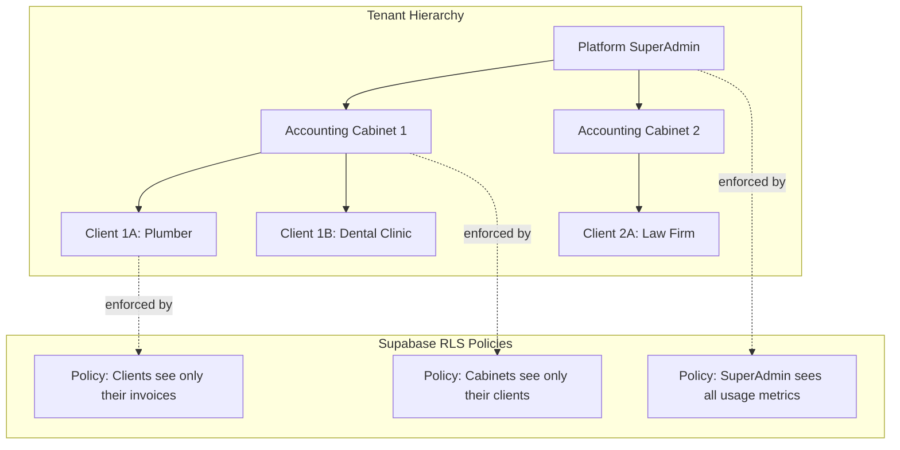
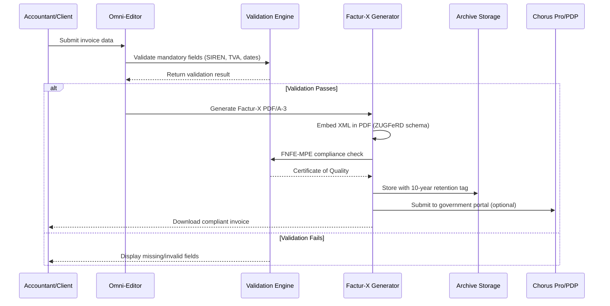
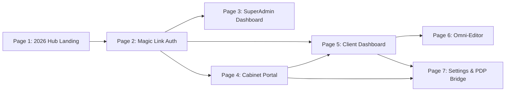
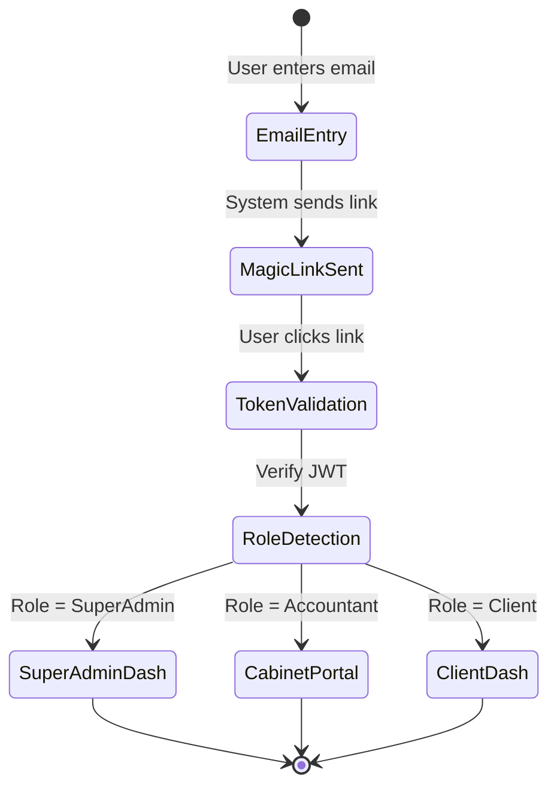
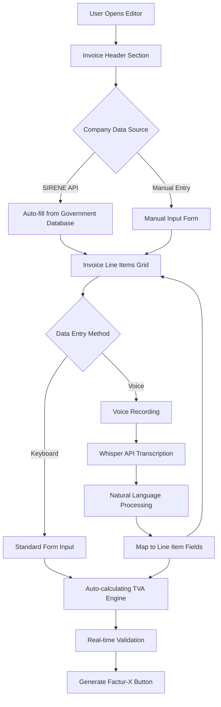
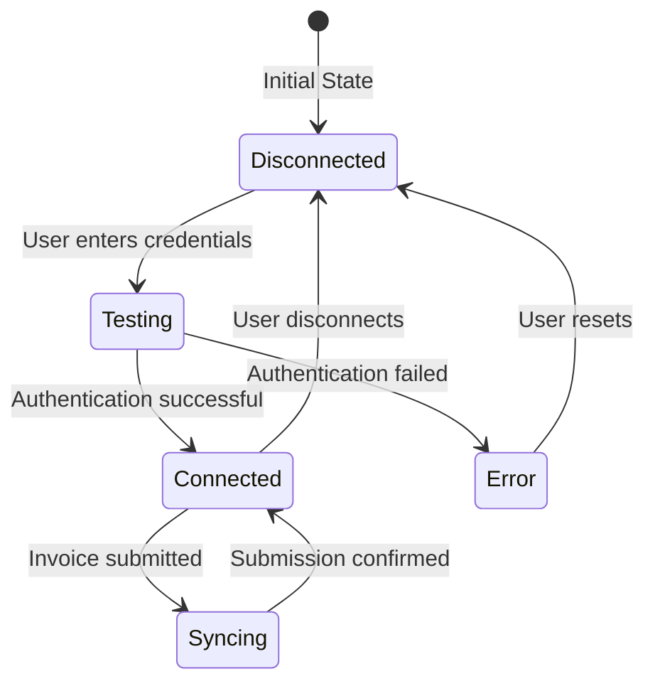
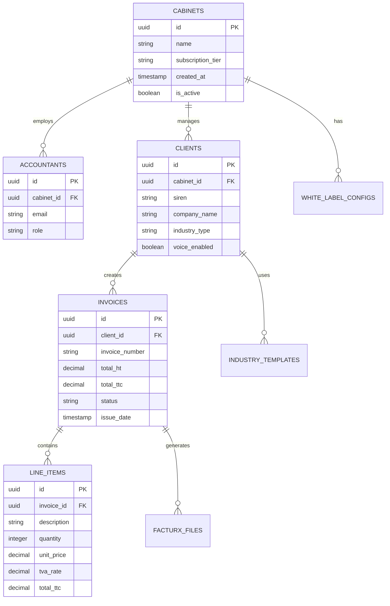
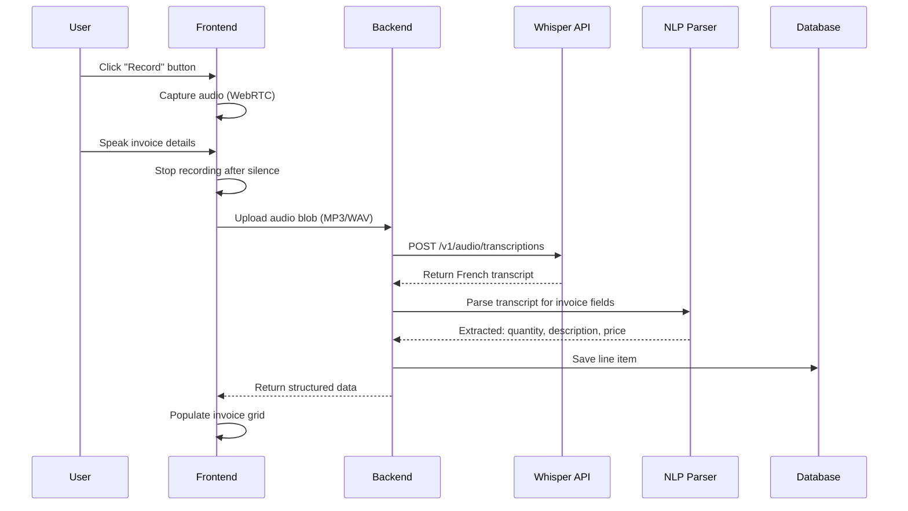

# OmniFactur (v.2026 Compliance) - Design Document

## 1. Project Vision

OmniFactur is a multi-tenant B2B2B SaaS platform enabling French accounting firms to manage mandatory e-invoicing compliance (2026 deadline) for their entire client portfolio across diverse industries including Trades, Medical, Legal, and Retail sectors.

**The Accountant's Fear**: With the January 2026 mandate, accountants are terrified of becoming "data entry clerks" managing digital invoicing chaos for 50+ clients. OmniFactur positions them as "2026 compliance partners" instead.

**The €990 Value Equation**: Accountants will pay €990/month because three features save them 10+ hours per month:
1. **White-Labeled Portal**: Clients see "Cabinet Dupont's Compliance Tool," not a third-party app - strengthening the accountant-client relationship
2. **FEC Connector**: One-click export that imports into Cegid Quadra with ZERO manual corrections - the killer feature
3. **Compliance Monitor**: Traffic-light dashboard showing each client's 2026 readiness - transforms accountants into proactive advisors

### 1.1 Strategic Objectives

- Enable accounting cabinets to serve 50+ clients simultaneously through a unified compliance hub
- Reduce accountant workload by 10+ hours per week through automation
- Ensure 100% compliance with French e-invoicing regulations (Factur-X standard, FNFE-MPE validation)
- Provide zero-capital launch path with progressive monetization

### 1.2 Value Proposition by User Type

| User Type | Primary Value | Revenue Impact |
|-----------|---------------|----------------|
| Accounting Firms | White-labeled platform managing fleet of clients; bulk FEC exports that import cleanly into Cegid/ACD with zero errors; compliance monitoring transforms them from "data entry clerks" into "compliance advisors" | €990/month per cabinet |
| SME Clients | Industry-specific invoicing templates; voice-enabled data entry; automatic TVA calculations; branded experience through their accountant's portal | Retained through accountant relationship |
| Platform Owner | Multi-tenant infrastructure; usage analytics; minimal hosting overhead | Scalable recurring revenue with €10k MRR achievable at 10 cabinets |

## 2. System Architecture Strategy

### 2.1 Technology Stack Selection

| Layer | Technology | Strategic Rationale |
|-------|-----------|---------------------|
| Frontend Framework | Next.js 15 (App Router) | Hybrid SSR/SSG for French local SEO optimization; Edge functions for sub-200ms response times; Built-in API routes for serverless backend logic |
| Programming Language | TypeScript | Strict type safety critical for fiscal calculations where TVA miscalculations have legal consequences; Enhanced IDE support for complex multi-tenant logic |
| Backend & Database | Supabase (PostgreSQL) | Row-Level Security for multi-tenant data isolation; Real-time subscriptions for collaborative invoice editing; Built-in authentication with magic links; EU data residency via Frankfurt deployment |
| File Generation Engine | Factur-X Open Source | Hybrid PDF/A-3 + XML embedded format mandated by French government; Libraries: @stafyniaksacha/facturx (Node) or factur-x (Python); Zero licensing costs |
| Voice Transcription | OpenAI Whisper API | 96%+ accuracy for technical French terminology; Pay-per-use model (€0.006/min); Industry-specific vocabulary training capability |
| Hosting Infrastructure | Scaleway Paris Region | Mandatory EU data residency for GDPR Article 44; Accountant trust factor for regulated data; Proximity reduces latency for French users |
| UI Component Library | Tailwind CSS + Lucide React Icons | Mobile-first responsive design; Professional aesthetic aligned with accounting industry; Low bundle size for performance |

### 2.2 Multi-Tenancy Architecture

#### 2.2.1 Data Isolation Model

#### 2.2.2 Row-Level Security Strategy (CRITICAL REQUIREMENT)

**Non-Negotiable Principle**: An accountant from Firm A must NEVER, under any circumstance, be able to query a client from Firm B. This is the foundation of multi-tenant trust in a B2B2B platform.

| Entity | Isolation Rule | Implementation Approach | Security Testing Required |
|--------|----------------|-------------------------|---------------------------|
| Invoices | Client can access only invoices where `client_id = auth.uid()` | RLS policy using `auth.uid()` comparison | Test cross-client access attempts with valid JWT tokens |
| Clients | Accountant can access clients where `cabinet_id = user_cabinet_id` | Join through `cabinet_memberships` table | Verify accountant A cannot SELECT client from cabinet B |
| Cabinets | SuperAdmin can access all; Accountants only their own | Role-based policy with `user_role` check | Test role escalation attempts via JWT manipulation |
| FEC Exports | Scoped to cabinet's client portfolio | Aggregate query with cabinet boundary enforced at query level | Validate exported data contains zero cross-cabinet records |

**Bulletproof RLS Validation Checklist**:
1. Every table with client-specific data must have `cabinet_id` foreign key
2. No direct foreign key relationships between cabinets (enforce via application logic)
3. All SELECT queries must include cabinet_id filter in WHERE clause via RLS
4. Audit logs must track all cross-cabinet query attempts (should always be zero)
5. Penetration testing: Attempt to access other cabinet data using modified API requests
6. Database triggers to prevent INSERT/UPDATE operations that violate cabinet boundaries

### 2.3 Compliance & Legal Architecture

#### 2.3.1 Factur-X 1.0.08 Specification Compliance (2026 Mandate)

**Critical Update**: The Factur-X 1.0.08 specification (released December 2024) is MANDATORY for the January 2026 e-invoicing launch. This version supersedes all previous releases.

**Key Changes from Previous Versions**:
- Enhanced XML schema validation requirements
- Updated semantic data model aligned with EN 16931-1:2017
- Stricter PDF/A-3b conformance checks
- Additional mandatory fields for cross-border transactions within EU

**Validation Workflow**: All generated invoices MUST pass FNFE-MPE validation service before being considered compliant. This is the Certificate of Quality that proves to accountants your platform meets legal requirements.

#### 2.3.2 Factur-X Generation Workflow

#### 2.3.3 Legal Compliance Requirements

| Regulation | Requirement | Design Implementation | Validation Method |
|------------|-------------|----------------------|-------------------|
| French Tax Code Article 289 | Mandatory SIREN on all invoices | Form validation blocks submission without valid SIREN lookup | SIRENE API verification |
| 2026 E-Invoicing Mandate | Factur-X 1.0.08 format for B2B transactions | Factur-X library updated to 1.0.08 specification | FNFE-MPE validation service |
| GDPR Article 17 | Right to erasure after 10 years | Automated archive retention with deletion workflow | Audit log review |
| PDF/A-3b Standard | Long-term archival format with embedded XML | Factur-X 1.0.08 library ensures PDF/A-3b compliance | VeraPDF validation tool |
| TVA Directive 2006/112/EC | Accurate VAT calculation and display | Multi-rate TVA engine with 5.5%, 10%, 20% presets | Automated calculation tests |

**FNFE-MPE Validation Integration**:
- Endpoint: Official French government validation service
- Validation Timing: Pre-delivery (before invoice is sent to client)
- Failure Handling: Block invoice finalization; display specific non-compliance errors
- Success Indicator: Generate validation certificate with timestamp and reference number
- Accountant Dashboard: Display validation status for all invoices with certificate download

## 3. User Experience Design

### 3.1 Application Structure

### 3.2 Page Specifications

#### 3.2.1 Page 1: The "2026 Hub" (Landing Page)

**Purpose**: High-trust marketing entry point targeting accounting firms with urgency-driven messaging.

**Visual Design Strategy**:
- Color Palette: Sovereign Blue (#002395) as primary; White backgrounds; Trust indicators
- Typography: Professional sans-serif for legal credibility
- Iconography: Shield (compliance), Bank-Note (invoicing), Mic (voice features) from Lucide React

**Functional Components**:

| Component | Behavior | Design Rationale |
|-----------|----------|------------------|
| Mandate Deadline Counter | Real-time countdown to January 1, 2026 | Creates urgency; reinforces regulatory pressure |
| Call-to-Action Button | "Schedule a Cabinet Demo" redirects to Calendly/booking | Converts visitors to qualified leads |
| Trust Indicators Section | Display compliance badges (FNFE-MPE, GDPR) | Overcomes accountant skepticism |
| Feature Carousel | Showcases white-labeling, bulk exports, voice input | Communicates value proposition |

#### 3.2.2 Page 2: Auth Gateway (Magic Link)

**Purpose**: Frictionless passwordless authentication with automatic role-based routing.

**Authentication Flow**:

**Security Considerations**:
- Magic link expiration: 15 minutes
- One-time use tokens to prevent replay attacks
- IP address validation for suspicious login patterns
- Session duration: 8 hours for clients, 12 hours for accountants

#### 3.2.3 Page 3: SuperAdmin Dashboard

**Purpose**: Platform-level monitoring and cabinet management for internal operations.

**Key Metrics Display**:

| Metric Category | Specific KPIs | Visualization Type |
|----------------|---------------|-------------------|
| Cabinet Growth | Total cabinets, MRR, churn rate | Line chart with trend indicators |
| Invoice Volume | Total invoices processed, invoices per cabinet | Bar chart by month |
| System Health | API response times, error rates, storage usage | Real-time status cards |
| Revenue Analytics | Revenue per cabinet, average client count | Funnel diagram |

**Management Capabilities**:
- Create new cabinet accounts with trial period
- Suspend/reactivate cabinet subscriptions
- View detailed usage logs for billing disputes
- Export platform-wide analytics for investor reporting

#### 3.2.4 Page 4: Cabinet Portal (Accountant's View)

**Purpose**: Fleet management interface for accountants managing 50+ client portfolios.

**Primary Interface Elements**:

| Section | Functionality | User Value |
|---------|--------------|-----------|
| Multi-Client List | Searchable/filterable table of all clients | Quick navigation across portfolio |
| Bulk Actions Toolbar | Select multiple clients for batch operations | Time savings on repetitive tasks |
| Compliance Status Matrix | Visual grid showing each client's 2026 readiness | Risk management at a glance |
| Quick Statistics Panel | Total invoices, unpaid amounts, upcoming deadlines | Portfolio health monitoring |

**Critical Bulk Operations**:

1. **FEC Export**: Generate consolidated Fichier des Écritures Comptables for all selected clients in single .fec file compatible with Cegid, Sage, ACD software
2. **Factur-X Archive Download**: ZIP file containing all compliant invoices for selected clients
3. **Compliance Report Generation**: PDF report showing legal mention completeness for each client
4. **White-Label Configuration Sync**: Apply branding changes across all client interfaces

#### 3.2.5 Page 5: Client Dashboard

**Purpose**: High-level financial overview with industry-specific enhancements.

**Adaptive Interface Design**:

| Industry Template | Enabled Features | Customization Logic |
|-------------------|------------------|---------------------|
| Plumber Mode | Voice input, material cost presets, travel time billing | Activated via industry toggle |
| Medical Mode | Patient ID reference, insurance billing codes, prescription tracking | HIPAA-equivalent data handling |
| Legal Mode | Case reference linking, hourly rate templates, retainer tracking | Confidentiality markers |
| Retail Mode | Inventory integration hints, multiple TVA rates, cash register sync | High-volume transaction support |

**Core Dashboard Metrics**:
- Total Invoices Issued (current month/year)
- Outstanding Amount (Unpaid invoices with aging analysis)
- TVA Summary (Total collected by rate: 5.5%, 10%, 20%)
- Compliance Score (0-100 based on mandatory field completeness)

#### 3.2.6 Page 6: The "Omni-Editor" (Invoicing Engine)

**Purpose**: Core invoice creation interface with AI-enhanced data entry and real-time validation.

**Functional Architecture**:

**Voice Control Workflow**:

| Step | User Action | System Response |
|------|-------------|----------------|
| 1. Activation | Click "Record" button with microphone icon | Begin audio capture; visual waveform indicator |
| 2. Speech Input | Speak: "Add line item: 5 meters copper pipe at 12 euros per meter" | Real-time transcription display |
| 3. NLP Processing | Automatic after silence detection | Extract: quantity=5, description="copper pipe", unit_price=12 |
| 4. Field Mapping | System populates grid row | Auto-select appropriate TVA rate (20% for materials) |
| 5. Confirmation | User reviews and edits if needed | Calculate line total and update invoice sum |

**TVA Calculation Engine**:

| TVA Rate | Application Scope | Validation Rule |
|----------|------------------|----------------|
| 5.5% | Essential goods (food, books, medical supplies) | Product category must be whitelisted |
| 10% | Restaurant services, passenger transport, renovation work | Service type verification required |
| 20% | Standard rate for all other goods and services | Default when no special category applies |

**SIRENE API Integration**:
- Purpose: Validate and auto-fill French company registration data
- Endpoint: INSEE SIRENE open data API
- Data Retrieved: Company name, legal form, address, VAT number, business sector
- Caching Strategy: Store lookups for 90 days to reduce API calls

#### 3.2.7 Page 7: Settings & Plateforme Agréée Bridge

**Purpose**: Configuration hub for archive management, government platform integrations, and white-labeling.

**Configuration Categories**:

| Category | Settings | Compliance Impact |
|----------|----------|-------------------|
| Archive Management | Retention period selector (default 10 years), storage location preference | Legal requirement for audit trail |
| Plateforme Agréée Integration | Connection status to Chorus Pro or certified PAs, API credentials, validation certificate history | Government submission capability |
| White-Label Branding | Cabinet logo upload, color scheme customization, email template editor | Accountant value proposition |
| User Management | Add/remove team members, role assignment, permission matrix | Multi-user cabinet support |
| Notification Preferences | Email alerts for unpaid invoices, compliance warnings, system updates | Proactive risk management |

**Plateforme Agréée Bridge Status Indicator**:

## 4. Data Model Strategy

### 4.1 Core Entity Relationships

### 4.2 Data Field Specifications

#### 4.2.1 Invoices Table Structure

| Field Name | Data Type | Constraints | Purpose |
|------------|-----------|-------------|---------|
| id | UUID | Primary Key | Unique invoice identifier |
| client_id | UUID | Foreign Key, NOT NULL | Links to owning client |
| invoice_number | VARCHAR(50) | UNIQUE, NOT NULL | Sequential legal numbering |
| issue_date | DATE | NOT NULL | Invoice creation date |
| due_date | DATE | NOT NULL | Payment deadline |
| total_ht | DECIMAL(10,2) | NOT NULL | Total excluding TVA |
| total_tva | DECIMAL(10,2) | NOT NULL | Total TVA amount |
| total_ttc | DECIMAL(10,2) | NOT NULL | Total including TVA |
| status | ENUM | 'draft', 'issued', 'paid', 'overdue' | Payment status |
| facturx_file_path | VARCHAR(255) | NULL | Link to generated PDF |
| created_by | UUID | Foreign Key | User who created invoice |
| metadata | JSONB | NULL | Industry-specific fields |

#### 4.2.2 Required Legal Fields Validation

| Field | Regulation Source | Validation Rule |
|-------|------------------|----------------|
| SIREN | INSEE Registration | 9 digits, checksum validation via Luhn algorithm |
| VAT Number | EU VAT Directive | FR + 11 characters, validated against VIES database |
| Legal Mentions | French Commercial Code | Company name, legal form, share capital, RCS registration |
| TVA Breakdown | Tax Code Article 242 | Separate line for each TVA rate applied |

### 4.3 Multi-Tenant Data Isolation Rules

| Scenario | Isolation Mechanism | SQL Policy Example Description |
|----------|--------------------|---------------------------------|
| Client viewing own invoices | RLS on invoices table | Policy allows SELECT where client_id equals authenticated user's client_id |
| Accountant viewing cabinet clients | RLS with join to cabinet_memberships | Policy allows SELECT where cabinet_id matches user's cabinet via membership table |
| SuperAdmin viewing all data | Bypass RLS for admin role | Policy allows unrestricted SELECT when user role is 'superadmin' |
| Cross-cabinet data leakage prevention | Cabinet_id foreign key constraints | All child records inherit cabinet_id from parent; no joins across cabinets allowed |

## 5. Feature Implementation Strategy

### 5.1 The "Accountant Logic" (€990 Cabinet License Justification)

#### 5.1.1 Feature 1: White-Labeling System

**Strategic Value**: This feature transforms the accountant from a "software reseller" into a "technology provider." When clients log into "Cabinet Dupont's 2026 Compliance Platform" (not "OmniFactur"), the accountant strengthens their client relationship and justifies their advisory fees.

**The Hook for Accountants**: "Your clients are terrified of becoming data entry clerks for digital invoicing. By offering them 'your firm's official 2026 compliance tool,' you position your cabinet as the essential compliance partner, not just a tax filer."

**Business Purpose**: Enable accountants to present the platform as their proprietary solution, enhancing perceived value and locking clients into the accounting firm's ecosystem.

**Customization Scope**:

| Element | Customization Level | Implementation Approach |
|---------|---------------------|------------------------|
| Logo | Full replacement | Upload interface with image optimization; SVG preferred for scalability |
| Color Scheme | Primary and accent colors | CSS custom properties override; theme generator with accessibility contrast checking |
| Email Templates | Footer branding, sender name | Transactional email service (e.g., SendGrid) with dynamic template variables |
| Domain Name | Optional custom subdomain | CNAME configuration with SSL certificate provisioning |
| Login Page | Custom welcome message | CMS-style text editor with preview mode |

**Technical Architecture**:
- Branding configuration stored in `white_label_configs` table linked to cabinet_id
- Client sessions load branding via middleware that injects CSS variables and logo URLs
- Fallback to default OmniFactur branding if configuration is incomplete

#### 5.1.2 Feature 2: FEC Connector (THE MOST IMPORTANT BUTTON)

**Strategic Importance**: This is the feature that justifies the €990/month price point. If the FEC export imports cleanly into Cegid Quadra or ACD without errors, accountants will pay for the platform solely for this time-saving capability.

**Accountant Pain Point**: Manual FEC file creation and correction consumes 10+ hours per month. Clean, automated FEC export is worth its weight in gold to accounting firms.

**Business Purpose**: Enable seamless export of all client invoicing data into standardized French accounting format for import into Cegid, Sage, or ACD software with ZERO manual corrections required.

**FEC File Specification** (per French Tax Bulletin BOI-CF-IOR-60-40-20):

| Column | Data Mapping | Format Rule |
|--------|-------------|-------------|
| JournalCode | Fixed value "VE" (Ventes/Sales) | Alphanumeric, 2-3 chars |
| JournalLib | "Ventes" or custom journal name | Text |
| EcritureNum | Invoice number | Sequential per journal |
| EcritureDate | Invoice issue_date | YYYYMMDD |
| CompteNum | Client account code (411 + SIREN) | French chart of accounts |
| CompteLib | Client company name | Text |
| CompAuxNum | Client SIREN | 9 digits |
| PieceRef | Invoice reference number | Text |
| PieceDate | Invoice date | YYYYMMDD |
| EcritureLib | Line item description | Text |
| Debit | Amount if debit entry | Decimal with comma separator |
| Credit | Amount if credit entry | Decimal with comma separator |
| Montantdevise | Foreign currency amount | Decimal or blank |

**Export Workflow with Quality Assurance**:
1. Accountant selects clients from Cabinet Portal (multi-select checkbox)
2. System queries all invoices for selected clients within date range
3. Generate double-entry accounting records (debit customer account, credit revenue accounts)
4. Apply French Chart of Accounts mapping (Plan Comptable Général)
5. Format as pipe-delimited text file per FEC specification
6. **Critical Validation**: Run automated quality checks for:
   - Balanced debits and credits (must equal to the cent)
   - Sequential EcritureNum without gaps
   - Valid date formats (YYYYMMDD)
   - Decimal formatting with comma separator (French standard)
   - Character encoding (ISO-8859-15 or UTF-8 with BOM)
7. Test import into sample Cegid/ACD database (validation environment)
8. Display validation report: "FEC file ready for import - 0 errors detected"
9. Provide download with filename format: `{SIREN}FEC{YYYYMMDD}.txt`

**Quality Guarantee**: Before launch, test FEC exports with at least 3 real accounting firms using Cegid Quadra, Sage 100, and ACD to ensure zero import errors. This is non-negotiable for market credibility.

#### 5.1.3 Feature 3: Compliance Monitor

**Strategic Positioning**: Transforms accountants from "reactive problem-solvers" into "proactive compliance advisors." When they can show clients a dashboard with specific 2026 readiness gaps, they justify their advisory fees beyond basic bookkeeping.

**Business Purpose**: Proactive dashboard alerting accountants to clients at risk of 2026 non-compliance, enabling early intervention and demonstrating advisory value.

**Monitoring Dimensions**:

| Compliance Check | Pass Criteria | Alert Trigger | Resolution Action |
|------------------|---------------|---------------|-------------------|
| SIREN Validity | 9-digit number validated against INSEE API | Missing or invalid SIREN | One-click SIRENE API lookup |
| VAT Number | EU VIES database confirmation | Missing or unverified VAT number | Auto-generate from SIREN + validation |
| Legal Mentions | Company name, legal form, RCS number present | Any mandatory field blank | Template-guided completion wizard |
| Factur-X 1.0.08 Capability | At least one invoice generated in compliant format | Zero compliant invoices issued | Guided invoice creation tutorial |
| FNFE-MPE Validation | All invoices pass government validation | Any invoice rejected by validation service | Display specific validation errors with fix instructions |
| Archive Readiness | Storage location configured with 10-year retention | Archive settings incomplete | One-click default configuration |
| Plateforme Agréée Connection | Active connection to Chorus Pro or certified PA | Disconnected status | Step-by-step PA integration guide |

**Dashboard Visualization (Designed for Client Meeting Context)**:
- Traffic light system: Green (100% compliant), Yellow (1-2 warnings), Red (3+ warnings)
- Sortable table showing client name, compliance score (0-100), specific missing items
- "Meeting-Ready" export: One-click PDF report branded with accountant's logo showing each client's 2026 readiness status
- Bulk action: "Send Compliance Reminder Emails" to all yellow/red clients with specific tasks
- One-click action buttons: "Fix SIREN", "Complete Legal Mentions", "Test PA Connection"
- Historical tracking: Show compliance improvement trends over time to demonstrate accountant's value

**The Accountant's Sales Tool**: This dashboard becomes the centerpiece of quarterly client review meetings. Accountants can show "We've improved your compliance score from 65% to 95% this quarter" - justifying their fees and demonstrating proactive value.

### 5.2 Industry-Specific Templates

**Purpose**: Reduce data entry time by pre-configuring invoice structures for common professional use cases.

#### 5.2.1 Plumber Mode

**Activated Features**:
- Voice input enabled by default
- Pre-loaded material catalog (pipes, fittings, fixtures) with standard pricing
- Travel time billing calculator (distance in km × hourly rate)
- Emergency call premium surcharge option

**Template Structure**:
| Section | Auto-filled Fields | User Input Required |
|---------|-------------------|---------------------|
| Client Info | Residential address from previous jobs | Service location if different |
| Materials | Common items from catalog | Quantities used |
| Labor | Standard hourly rate from profile | Hours worked per task |
| Travel | Distance from base location | Confirmation of calculated amount |

#### 5.2.2 Medical Mode

**Activated Features**:
- Patient ID reference field (anonymized for GDPR)
- Insurance billing code dropdown (Assurance Maladie nomenclature)
- Prescription number tracking for reimbursement audit trails
- Separate TVA rate handling (medical services often exempt or reduced rate)

**Data Privacy Considerations**:
- Patient names stored encrypted at rest
- Optional pseudonymization for export to accountants
- Automatic redaction in FEC files per healthcare regulations

#### 5.2.3 Legal Mode

**Activated Features**:
- Case reference linking (dossier numbers)
- Hourly rate templates by service type (consultation, court representation, research)
- Retainer tracking with deduction from invoice totals
- Confidentiality markers for sensitive client matters

**Billing Workflow**:
- Time tracking integration hints (manual entry of hours per case)
- Automatic calculation of fees based on hourly rates
- Retainer balance deduction with running ledger display

#### 5.2.4 Retail Mode

**Activated Features**:
- Inventory integration readiness (placeholder for future POS sync)
- Multiple TVA rate handling within single invoice (mixed-goods scenarios)
- High-volume transaction support (batch import of sales data)
- Cash register reconciliation helper (daily totals entry)

**Performance Optimization**:
- Pagination for invoices table (display 50 rows at a time)
- Bulk creation API endpoint for batch uploads
- Summary view mode (collapse line items, show totals only)

## 6. Integration Specifications

### 6.1 SIRENE API Integration

**Purpose**: Validate French company registration numbers and auto-populate company details.

**API Endpoint**: `https://api.insee.fr/entreprises/sirene/V3/siren/{siren}`

**Authentication**: Bearer token from INSEE developer portal

**Request Flow**:
1. User enters 9-digit SIREN in invoice header
2. Frontend triggers debounced API call after 500ms pause
3. Backend validates response and caches result
4. Auto-fill fields: company name, legal address, VAT number, business sector

**Error Handling**:
- Invalid SIREN: Display validation error, prevent invoice submission
- API timeout: Allow manual entry with warning indicator
- Rate limit exceeded: Use cached data if available, queue retry

### 6.2 OpenAI Whisper API Integration

**Purpose**: Convert spoken French into structured invoice line items.

**Technical Workflow**:

**NLP Parsing Rules**:

| Speech Pattern | Extraction Logic | Example |
|----------------|------------------|---------|
| "{quantity} {item} à {price} euros" | quantity=int, description=item, unit_price=float | "5 mètres de câble à 12 euros" → qty=5, desc="câble", price=12 |
| "{item} pour {total} euros" | description=item, total_price=float, quantity=1 | "Consultation pour 80 euros" → desc="Consultation", price=80 |
| "TVA à {rate} pourcent" | tva_rate=float | "TVA à 20 pourcent" → tva_rate=20 |

**Cost Management**:
- Audio compression before upload (target: < 1MB per recording)
- Usage tracking per client to identify abuse patterns
- Monthly quota alerts for cabinet admins

### 6.3 Plateforme Agréée (PA) Integration

**Terminology Update**: As of late 2025, DGFiP officially replaced "PDP" (Plateforme de Dématérialisation Partenaire) with "Plateforme Agréée" (PA) to clarify platform certification roles. All UI and marketing materials MUST use "PA" terminology.

**Purpose**: Submit compliant Factur-X 1.0.08 invoices to French government e-invoicing ecosystem via certified platforms.

**Integration Architecture**:

| PA Type | Connection Method | Data Format | Certification Status |
|---------|------------------|-------------|---------------------|
| Chorus Pro | REST API with OAuth 2.0 | Factur-X 1.0.08 PDF + XML metadata | Government-operated (default) |
| Certified Private PAs | SFTP or API per provider specs | Factur-X 1.0.08 compliant format | DGFiP certification required |

**Submission Workflow**:
1. User generates invoice in Omni-Editor
2. System validates against Factur-X 1.0.08 specification
3. FNFE-MPE validation service confirms compliance
4. System creates Factur-X file with embedded XML
5. Optional: Automatic submission to configured Plateforme Agréée
6. PA returns acknowledgment receipt with tracking number
7. System stores receipt and updates invoice status to "Submitted"

**Status Tracking States**:
- Not Configured: PA credentials missing
- Ready: Connected but not submitted
- Validating: FNFE-MPE validation in progress
- Submitted: Sent to PA, awaiting confirmation
- Accepted: Government portal confirmed receipt
- Rejected: Validation error, requires correction

**UI Terminology Requirements**:
- Settings page label: "Connexion à une Plateforme Agréée"
- Status indicator: "Statut PA" (not "Statut PDP")
- Help text: "Les Plateformes Agréées sont certifiées par la DGFiP pour la transmission des factures électroniques"

## 7. Business Model & Monetization

### 7.1 Pricing Strategy

| Tier | Target User | Monthly Price | Included Features |
|------|-------------|---------------|-------------------|
| Beta Rate | First 2 pilot cabinets | €490/month | All features; feedback priority; 6-month lock-in |
| Standard Cabinet License | Established accounting firms | €990/month | Unlimited clients; white-labeling; bulk exports; compliance monitoring |
| Enterprise (Future) | Large cabinets (>100 clients) | Custom pricing | Dedicated support; custom integrations; on-premise option |

### 7.2 Zero-Capital Launch Path

**Phase 1: MVP Development (Months 1-2)**
- Technology: Vercel free tier (hosting), Supabase free tier (database)
- Cost: €0
- Deliverable: Functional prototype with core invoicing features
- **Critical**: Validate Factur-X 1.0.08 library and RLS policies before beta launch

**Phase 2: Beta Pre-Sales (Month 3)**
- Goal: Sign 2 pilot cabinets at €490/month
- Revenue: €980/month
- Investment: Purchase .fr domain (€15), legal CGV templates (€300), Scaleway Pro credits (€200)
- **Validation**: Test FEC exports with pilot accountants' actual Cegid/ACD installations - must achieve zero import errors

**Phase 3: Full Launch (Month 4+)**
- Pricing: Increase to €990/month for new cabinets
- Goal: 3 case studies demonstrating 10+ hours saved per week through FEC automation and white-labeling
- Revenue Target: €5,000/month (5 cabinets) for operational sustainability
- Marketing Message: "Your firm's official 2026 compliance platform - not a generic tool"

### 7.3 Revenue Projections

| Metric | 6 Months | 12 Months | 24 Months |
|--------|----------|-----------|-----------|
| Active Cabinets | 5 | 15 | 40 |
| Monthly Recurring Revenue | €4,950 | €14,850 | €39,600 |
| Average Clients per Cabinet | 30 | 40 | 50 |
| Total End-Users Served | 150 | 600 | 2,000 |

## 8. Risk Management

### 8.1 Technical Risks

| Risk | Likelihood | Impact | Mitigation Strategy |
|------|------------|--------|---------------------|
| Multi-tenant data leakage (Cabinet A sees Cabinet B data) | Low | Critical | Extensive RLS policy testing; penetration testing with JWT manipulation attempts; audit logging of all cross-cabinet queries (should be zero) |
| Factur-X 1.0.08 validation failures | Medium | High | Implement FNFE-MPE validation library; test with 100 invoices before launch; maintain validation certificate archive |
| FEC import errors in Cegid/ACD | High | Critical | Test exports with real accounting software during beta phase; validate balanced debits/credits to the cent; verify decimal formatting |
| Supabase free tier limits exceeded | High | Medium | Monitor usage daily; migrate to paid tier when approaching 500MB database size |
| Voice API costs exceed budget | Medium | Medium | Implement per-client monthly quotas; warn users at 80% usage |

### 8.2 Compliance Risks

| Risk | Likelihood | Impact | Mitigation Strategy |
|------|------------|--------|---------------------|
| Government regulation changes | Medium | High | Subscribe to official tax bulletin updates; maintain flexible architecture for schema changes |
| GDPR data breach | Low | Critical | Encrypt PII at rest; regular security audits; incident response plan |
| Accountant professional liability | Low | High | Clear terms of service disclaiming calculation responsibility; recommend manual review |

### 8.3 Business Risks

| Risk | Likelihood | Impact | Mitigation Strategy |
|------|------------|--------|---------------------|
| Competitor launches similar platform | Medium | High | Focus on accountant-specific features (white-labeling, FEC export) as differentiation |
| Accountants resist new technology | High | Medium | Offer free migration assistance; demonstrate time savings with pilot case studies |
| Payment defaults from cabinets | Medium | Medium | Require credit card on file; suspend access after 7 days non-payment |

## 9. Success Metrics

### 9.1 Platform Health Indicators

| Metric | Target | Measurement Method |
|--------|--------|-------------------|
| Average Invoice Creation Time | < 3 minutes | Track from editor open to Factur-X generation |
| Voice Transcription Accuracy | > 95% | Manual audit of 100 random transcriptions |
| System Uptime | > 99.5% | Automated monitoring with UptimeRobot |
| API Response Time (p95) | < 500ms | Application performance monitoring |

### 9.2 User Adoption Metrics

| Metric | Target | Measurement Method |
|--------|--------|-------------------|
| Accountant Weekly Active Usage | > 80% login rate | Track authentication events |
| Clients Onboarded per Cabinet | 20+ within first month | Count client account creations |
| White-Label Activation Rate | > 60% of cabinets | Track logo uploads in settings |
| Voice Feature Usage | > 30% of invoices use voice | Log voice recording events |

### 9.3 Business Metrics

| Metric | Target | Measurement Method |
|--------|--------|-------------------|
| Monthly Churn Rate | < 5% | Track subscription cancellations |
| Net Promoter Score (Accountants) | > 50 | Quarterly survey |
| Time-to-Value | < 7 days from signup to first invoice | Onboarding funnel analysis |
| Customer Acquisition Cost | < 2 months MRR | Marketing spend ÷ new cabinets |

## 10. Development Priorities

### 10.1 Phase 1: Minimum Viable Product (Weeks 1-6)

**Critical Path Features**:
1. Multi-tenant authentication with magic links and role detection
2. Basic invoice editor with manual data entry and TVA calculation
3. Factur-X 1.0.08 PDF generation with embedded XML
4. FNFE-MPE validation service integration
5. Client list view for accountants with basic filtering
6. Bulletproof Supabase RLS policies for data isolation

**Success Criteria**: Accountant can create one compliant Factur-X 1.0.08 invoice for one client that passes FNFE-MPE validation in under 5 minutes.

**Launch-Ready Checklist for French Market**:
- [ ] RLS policies tested with cross-cabinet access attempts (must return zero results)
- [ ] Factur-X library updated to 1.0.08 specification
- [ ] Generated invoices validated through FNFE-MPE service
- [ ] All UI/marketing uses "Plateforme Agréée" (not "PDP")
- [ ] Penetration testing completed for multi-tenant isolation
- [ ] FEC export tested with Cegid Quadra import (zero errors)

### 10.2 Phase 2: Accountant Premium Features (Weeks 7-10)

**Features (Ordered by €990 Justification Value)**:
1. FEC export for multiple clients with Cegid/ACD validation
2. White-labeling system (logo upload, color customization, branded login page)
3. Compliance monitor dashboard with traffic light risk indicators
4. Bulk actions toolbar in Cabinet Portal

**Success Criteria**: 
- Accountant can manage 10 clients and export consolidated FEC that imports into Cegid Quadra with ZERO errors in under 10 minutes
- White-labeled portal displays accountant's branding on all client-facing pages
- Compliance monitor flags at least 3 common 2026 readiness gaps automatically

### 10.3 Phase 3: Industry-Specific Enhancements (Weeks 11-14)

**Features**:
1. Voice input integration with Whisper API
2. Plumber/Medical/Legal/Retail template activation
3. SIRENE API auto-fill
4. Advanced invoice grid with keyboard shortcuts

**Success Criteria**: Plumber creates 5-line-item invoice using voice in under 2 minutes.

### 10.4 Phase 4: Government Integration (Weeks 15-18)

**Features**:
1. Chorus Pro API connection
2. Plateforme Agréée (PA) status monitoring with updated terminology
3. 10-year archive storage workflow with automated retention
4. Automated FNFE-MPE compliance validation reports
5. Validation certificate generation and download

**Success Criteria**: 
- Invoice automatically submitted to Chorus Pro with acknowledgment receipt
- All generated Factur-X files validated through FNFE-MPE service before delivery
- Validation certificates stored with invoices for audit trail
- UI displays "Plateforme Agréée" terminology throughout

## 11. System Constraints & Assumptions

### 11.1 Technical Constraints

| Constraint | Implication | Design Decision |
|------------|-------------|-----------------|
| Supabase Row Limit (Free Tier) | Max 500MB database size | Implement archiving strategy; optimize JSONB usage |
| Vercel Function Timeout | 10 seconds for serverless functions | Use background jobs for FEC generation; implement progress indicators |
| Whisper API Rate Limit | 50 requests/minute | Queue voice processing; show wait time estimates |
| Browser Compatibility | Must support Chrome 90+, Firefox 88+, Safari 14+ | Use progressive enhancement; test on target browsers |

### 11.2 Business Assumptions

| Assumption | Validation Method | Contingency Plan |
|------------|------------------|------------------|
| Accountants will pay €990/month for time savings | Validate through 2 beta pilot interviews | Adjust pricing based on feedback; consider freemium tier |
| Average cabinet manages 30-50 clients | Research industry reports; validate with pilot users | Design scalability for 100+ clients per cabinet |
| Voice input provides 40% time savings | Measure during user testing | Make voice optional; optimize keyboard workflow |
| 2026 deadline creates urgency | Track landing page conversion rates | Emphasize other benefits (time savings, professionalism) |

### 11.3 Regulatory Assumptions

| Assumption | Verification Source | Risk If Incorrect |
|------------|---------------------|-------------------|
| Factur-X remains mandatory format | French tax authority bulletins | Need to support additional formats; development time 2-3 weeks |
| SIRENE API remains free | INSEE developer portal terms | Budget €200/month for commercial API access |
| 10-year archival requirement unchanged | Commercial Code Article L123-22 | Adjust retention settings; minimal development impact |

## 12. Open Questions & Decision Points

### 12.1 Technical Decisions Requiring User Input

1. **Database Migration Strategy**: When should we transition from Supabase free tier to paid tier?
   - Option A: Proactively at 300MB usage (safe buffer)
   - Option B: Wait until 450MB (cost optimization)

2. **Voice Processing Location**: Where should audio transcription occur?
   - Option A: Client-side processing with local Whisper model (privacy, slower)
   - Option B: Server-side with OpenAI API (faster, cost per use)

3. **White-Label Scope**: How deep should customization go?
   - Option A: Logo + colors only (fast implementation)
   - Option B: Full theme editor with CSS overrides (more valuable, complex)

### 12.2 Business Model Questions

1. **Pricing for Additional Users**: How to charge when a cabinet has multiple accountants?
   - Option A: Flat €990 covers up to 5 users
   - Option B: €990 base + €100 per additional user

2. **Client Direct Access**: Should clients be able to purchase standalone subscriptions?
   - Option A: Accountant-mediated only (preserves relationship)
   - Option B: Direct B2C tier at €49/month (additional revenue stream)

3. **International Expansion**: Priority for supporting other EU countries?
   - Option A: Focus exclusively on France for first 12 months
   - Option B: Plan for Belgian/Luxembourg compliance from Month 6

## 13. Appendices

### 13.1 Glossary of French Regulatory Terms

| Term | English Translation | Relevance |
|------|---------------------|-----------||
| Factur-X 1.0.08 | Hybrid PDF/XML e-invoice standard (2026 version) | Core file format for compliance; mandatory specification |
| SIREN | 9-digit company identification number | Mandatory on all invoices |
| TVA | Taxe sur la Valeur Ajoutée (VAT) | French value-added tax |
| FEC | Fichier des Écritures Comptables | Standardized accounting export format |
| Chorus Pro | Government e-invoicing portal | Public sector invoice submission platform |
| Plateforme Agréée (PA) | Certified e-invoicing platform | Replaced "PDP" terminology as of late 2025 |
| FNFE-MPE | Forum National de la Facture Électronique | Standards body for e-invoicing validation |
| DGFiP | Direction Générale des Finances Publiques | French tax authority governing e-invoicing mandate |

### 13.2 Reference Standards

| Standard | Version | Application | Critical Notes |
|----------|---------|-------------|----------------|
| Factur-X | 1.0.08 (December 2024) | Hybrid PDF/XML invoice format | MANDATORY for January 2026 compliance |
| PDF/A-3b | ISO 19005-3:2012 | Archival format for invoices | Updated from PDF/A-3 to stricter 3b variant |
| ZUGFeRD | 2.1.1 | XML schema embedded in Factur-X | Compatible with Factur-X 1.0.08 |
| EN 16931 | European Standard | Semantic data model for e-invoicing | Core specification for cross-border invoices |
| FEC Format | 2014 Specification | French accounting export structure | Required for Cegid/Sage/ACD import compatibility |

### 13.3 External Dependencies

| Dependency | Provider | Criticality | Fallback Plan | Version Requirements |
|------------|----------|-------------|---------------|----------------------|
| SIRENE API | INSEE (French statistics bureau) | Medium | Manual company data entry | Current API v3 |
| Whisper API | OpenAI | Low | Disable voice feature temporarily | Whisper-1 model |
| Factur-X Library | Open-source community | High | Maintain forked version for stability | 1.0.08 specification compliant |
| FNFE-MPE Validation Service | French government | Critical | Block invoice finalization if unavailable | Official validation endpoint |
| Supabase Platform | Supabase Inc. | Critical | Database backup strategy; consider self-hosted Postgres | Latest stable version |

### 13.3 External Dependencies

| Dependency | Provider | Criticality | Fallback Plan | Version Requirements |
|------------|----------|-------------|---------------|----------------------|
| SIRENE API | INSEE (French statistics bureau) | Medium | Manual company data entry | Current API v3 |
| Whisper API | OpenAI | Low | Disable voice feature temporarily | Whisper-1 model |
| Factur-X Library | Open-source community | High | Maintain forked version for stability | 1.0.08 specification compliant |
| FNFE-MPE Validation Service | French government | Critical | Block invoice finalization if unavailable | Official validation endpoint |
| Supabase Platform | Supabase Inc. | Critical | Database backup strategy; consider self-hosted Postgres | Latest stable version |
| Supabase Platform | Supabase Inc. | Critical | Database backup strategy; consider self-hosted Postgres | Latest stable version |

### 13.3 External Dependencies

| Dependency | Provider | Criticality | Fallback Plan | Version Requirements |
|------------|----------|-------------|---------------|----------------------|
| SIRENE API | INSEE (French statistics bureau) | Medium | Manual company data entry | Current API v3 |
| Whisper API | OpenAI | Low | Disable voice feature temporarily | Whisper-1 model |
| Factur-X Library | Open-source community | High | Maintain forked version for stability | 1.0.08 specification compliant |
| FNFE-MPE Validation Service | French government | Critical | Block invoice finalization if unavailable | Official validation endpoint |
| Supabase Platform | Supabase Inc. | Critical | Database backup strategy; consider self-hosted Postgres | Latest stable version |
